# AquaSentinel: Risk-Aware Water Safety Screening

**Can a model flag unsafe drinking water reliably enough to help a lab decide what to test first?** An end-to-end analysis of 3,276 public water samples that picks its decision threshold around the cost of a missed unsafe sample, and benchmarks itself against a rule built from real WHO / BIS / US EPA limits.

[](https://www.python.org/downloads/)
[](LICENSE)
[](https://www.kaggle.com/datasets/adityakadiwal/water-potability)
[](https://github.com/psf/black)
[](https://github.com/astral-sh/ruff)

> **Scope.** This is an analysis of a **public benchmark dataset**. It is **not** a deployed water-monitoring system, and nothing here should be used to decide that any real water is safe to drink.

<!-- BEGIN:AUTOGENERATED-HEADLINE -->
<!-- Generated by scripts/run_all.py. Do not edit by hand. -->

## The short answer

**Partly — and the honest limit matters more than the headline number.** The best model (**Random Forest**) reaches **ROC-AUC 0.693** (95% CI [0.651, 0.733]) on a held-out test set it saw exactly once. That is well above chance but far from a reliable screen.

Tuned for the error that actually costs something — a missed unsafe sample — it catches **89% of unsafe samples** at **67% precision**, while sending **80%** of all samples to the lab. Testing everything would catch 100% at 61% precision, so the model saves about **20% of lab capacity** and pays for it with **45 missed unsafe samples out of 400**.

| | Catches unsafe | Precision | Sends to lab |
|---|---|---|---|
| **Random Forest** (final) | 89% | 67% | 80% |
| Guideline rule (WHO/BIS/EPA limits) | 100% | 61% | 100% |
| Test everything (dummy baseline) | 100% | 61% | 100% |

The operating threshold (0.438, not the default 0.5) was chosen on cross-validated training predictions to hit a 90% recall target before the test set was touched. A rule built from published drinking-water limits performs no better than chance on this data — which says more about the dataset than about the guidelines.

<!-- END:AUTOGENERATED-HEADLINE -->

---

## The business question

> **Which water-quality parameters best indicate unsafe water, and can a model flag unsafe samples reliably enough to help prioritize lab testing?**

**Why it matters.** Laboratory confirmation of drinking-water safety is slow and expensive, so utilities and regulators cannot test everything at full depth. If cheap physicochemical readings could rank samples by risk, limited lab capacity could be pointed at the samples most likely to be unsafe.

That makes this an asymmetric-cost problem, and the asymmetry drives every design decision in this repository:

- A **false positive** wastes one lab test.
- A **false negative** lets unsafe water through unexamined.

So AquaSentinel does **not** optimise accuracy. It fixes a recall target on the unsafe class, then asks what precision is achievable at that target — and reports the answer whether or not it is flattering.

### The label, stated explicitly

The source data encodes `Potability = 1` for potable (safe). Because the costly error is a missed unsafe sample, this project models **UNSAFE as the positive class** throughout:

```python
unsafe = 1 - Potability      # 1 == UNSAFE == (Potability == 0)
```

This mapping is defined once in [`src/aquasentinel/config.py`](src/aquasentinel/config.py) and enforced by a test. Every "recall" in this README is recall on **UNSAFE**.

> **A detail that changes how you read every number:** UNSAFE is the **majority** class (~61%). A classifier that flags everything therefore achieves *100% recall for free*. Precision at high recall — not recall — is the scarce quantity, and that is the bar used throughout.

---

## Dataset

| | |
|---|---|
| **Source** | [Kaggle — Water Quality ("Water Potability") by Aditya Kadiwal](https://www.kaggle.com/datasets/adityakadiwal/water-potability) |
| **License** | `CC0: Public Domain` — verified via the Kaggle dataset API, so the CSV is committed here |
| **Downloaded** | 2026-10-01 (`kagglehub`, dataset version 3) |
| **Size** | 3,276 rows × 9 physicochemical features + 1 binary target |
| **SHA-256** | `904004bde729bfe3d2e195f46343bceead09e32a0eb95bb8184e7e20e029b2bf` |

Full column dictionary, provenance caveats and download instructions: **[`data/README.md`](data/README.md)**.

No download step is required to reproduce these results — the raw CSV is in the repository.

---

## Approach

```
   raw CSV (3,276 rows)
        │
        ├─ 1. Data audit ........... dtypes, duplicates, impossible values, missingness
        ├─ 2. EDA .................. distributions by class, correlations,
        │                            Mann-Whitney U + rank-biserial effect sizes
        ├─ 3. Rule baseline ........ "unsafe if any parameter breaches its limit",
        │                            limits taken from WHO GDWQ / BIS IS 10500 / US EPA
        │
        ├─ 4. Split ................ stratified 80/20, seed 42  ──────────┐
        │                                                                 │ TEST SET
        ├─ 5. Preprocessing ........ imputation + scaling INSIDE          │ SEALED
        │                            sklearn Pipelines (median vs KNN,    │
        │                            ± missing indicators, chosen by CV)  │
        ├─ 6. Modeling ............. dummy, rule, logistic regression,    │
        │                            random forest, gradient boosting,    │
        │                            XGBoost, LightGBM — randomised       │
        │                            search over repeated stratified CV   │
        ├─ 7. Threshold ............ chosen on CROSS-VALIDATED TRAINING   │
        │                            predictions to hit a 90% recall      │
        │                            target at the best precision         │
        │                                                                 │
        ├─ 8. Final evaluation ..... retrain on full train, score test ───┘ ← touched ONCE
        │                            + 2,000-resample bootstrap CIs
        ├─ 9. Explainability ....... permutation importance + SHAP,
        │                            compared against the guideline limits
        └─ 10. Error analysis ...... what the model cannot distinguish
```

**Discipline enforced in code, not by convention:**

- The test set is loaded once and scored once, in the final step.
- All preprocessing lives inside `Pipeline` / `ColumnTransformer`, so imputer and scaler statistics are refit on the training part of every CV fold. [`tests/test_pipeline_no_leakage.py`](tests/test_pipeline_no_leakage.py) proves it — including a test that poisons the test set and asserts the fitted statistics do not move.
- The imputation strategy is a *hyperparameter inside the search*, not a decision made by peeking at full-data performance.
- Every number, table and figure in this README is generated by [`src/aquasentinel/report.py`](src/aquasentinel/report.py) from files in `results/metrics/`. The README cannot disagree with the code.

### Where the guideline limits come from

The rule baseline uses only limits that could be **verified against an official source**, each recorded with its URL in [`config.py`](src/aquasentinel/config.py):

- **[WHO Guidelines for Drinking-water Quality, 4th ed. (Annex 3)](https://cdn.who.int/media/docs/default-source/wash-documents/water-safety-and-quality/dwq-guidelines-4/gdwq4-with-add1-annex3.pdf)** — notably, WHO sets **no health-based guideline value** for pH, hardness, sulfate or TDS ("Not of health concern at levels found in drinking-water"), and expresses trihalomethanes as a fractional-sum rule over individual species rather than a single total.
- **[BIS IS 10500:2012](https://infralens.in/code/IS-10500-2012)** — acceptable and permissible limits for pH, hardness, TDS, sulphate and turbidity.
- **[US EPA National Primary Drinking Water Regulations](https://www.epa.gov/ground-water-and-drinking-water/national-primary-drinking-water-regulations)** — the aggregate TTHM MCL (0.080 mg/L) and the chloramines MRDL (4.0 mg/L), which are the values that match this dataset's columns.

**Two of the nine parameters are deliberately excluded from the rule** because no numeric drinking-water limit could be verified for them. They are left out rather than guessed; the omission is listed in the results below.

---

## Results

<!-- BEGIN:AUTOGENERATED-RESULTS -->
<!-- Generated by scripts/run_all.py via src/aquasentinel/report.py. Do not edit by hand. -->

### Headline result

The best model was **Random Forest**, selected by cross-validated ROC-AUC on the training set. On the held-out test set (656 samples, 61.0% unsafe) it reached **ROC-AUC 0.693** [0.651, 0.733] and **PR-AUC 0.752** [0.705, 0.800].

At the risk-aware threshold of **0.438** it catches **88.8% of unsafe samples** at **67.4% precision**, flagging **80.3%** of all samples for lab testing and still missing **45 unsafe samples** out of 400.

### All models and baselines

| Model | Type | CV ROC-AUC (5×3, train) | Imputer chosen by CV |
|---|---|---|---|
| Random Forest **(final)** | model | 0.688 ± 0.018 | SimpleImputer + indicators |
| Gradient Boosting | model | 0.668 ± 0.021 | KNNImputer + indicators |
| XGBoost | model | 0.665 ± 0.016 | SimpleImputer + indicators |
| LightGBM | model | 0.659 ± 0.020 | SimpleImputer + indicators |
| Guideline rule baseline | baseline | 0.528 ± 0.018 | — |
| Logistic Regression | model | 0.510 ± 0.022 | SimpleImputer |
| Dummy (majority class) | baseline | 0.500 ± 0.000 | — |

*Cross-validated on the training set only, 5-fold × 3 repeats. Hyperparameters were searched with 40-candidate randomised search over 5-fold CV; the imputation strategy was part of that search.*

### Final model vs. baselines on the held-out test set

| Metric (UNSAFE = positive) | **Random Forest @ thr 0.438** | 95% CI (bootstrap) | Guideline rule baseline | Dummy (majority class) |
|---|---|---|---|---|
| ROC-AUC | 0.693 | [0.651, 0.733] | 0.484 | 0.500 |
| PR-AUC (average precision) | 0.752 | [0.705, 0.800] | 0.608 | 0.610 |
| Recall on UNSAFE | 0.887 | [0.854, 0.918] | 1.000 | 1.000 |
| Precision on UNSAFE | 0.674 | [0.634, 0.712] | 0.610 | 0.610 |
| F1 on UNSAFE | 0.766 | [0.735, 0.794] | 0.758 | 0.758 |
| Balanced accuracy | 0.608 | [0.574, 0.641] | 0.500 | 0.500 |
| Share of samples flagged for lab testing | 0.803 | — | 1.000 | 1.000 |
| Unsafe samples missed (false negatives) | 45 | — | 0 | 0 |
| Test samples | 656 | — | 656 | 656 |

*The test set was used exactly once, for this table. Confidence intervals are 2,000-resample bootstrap percentile intervals.*

### The chosen decision threshold

The operating threshold was chosen on **cross-validated predictions over the training set only** (the test set was untouched at this point). Among all thresholds reaching at least **90% recall on the UNSAFE class**, we keep the one with the highest precision.

- Recall target of 90% was reached in cross-validation.
- **Chosen threshold: 0.4384** on predicted P(UNSAFE) (cross-validated recall 0.901, precision 0.675).

**What the trade-off costs, measured on the test set:**

| | Default threshold 0.5 | Chosen threshold 0.438 | Change |
|---|---|---|---|
| Recall on UNSAFE | 0.743 | 0.887 | +0.145 |
| Precision on UNSAFE | 0.699 | 0.674 | -0.025 |
| Unsafe samples missed | 103 | 45 | -58 |
| Safe samples sent for testing anyway | 128 | 172 | +44 |
| Share of all samples flagged | 0.648 | 0.803 | +0.155 |

In plain terms: moving from the default cut-off to the risk-aware one catches **58 more unsafe samples** out of 400 in the test set, at the cost of sending **44 more safe samples** to the lab.

### Guideline-based rule baseline

| Parameter | Limit applied | Source | Rows breaching |
|---|---|---|---|
| `ph` | 6.5–8.5 pH units | BIS IS 10500:2012 (acceptable limit; no relaxation permitted) | 1,457 (44.5%) |
| `Hardness` | ≤ 600.0 mg/L (as CaCO3) | BIS IS 10500:2012 (permissible limit in absence of alternate source) | 0 (0.0%) |
| `Solids` | ≤ 2000.0 mg/L (total dissolved solids) | BIS IS 10500:2012 (permissible limit in absence of alternate source) | 3,271 (99.8%) |
| `Chloramines` | ≤ 4.0 mg/L (as Cl2) | US EPA National Primary Drinking Water Regulations (MRDL) | 3,187 (97.3%) |
| `Sulfate` | ≤ 400.0 mg/L (as SO4) | BIS IS 10500:2012 (permissible limit in absence of alternate source) | 138 (4.2%) |
| `Trihalomethanes` | ≤ 80.0 ug/L (total THMs) | US EPA National Primary Drinking Water Regulations (MCL for TTHMs) | 602 (18.4%) |
| `Turbidity` | ≤ 5.0 NTU | BIS IS 10500:2012 (permissible limit in absence of alternate source) | 314 (9.6%) |

**Excluded from the rule — no numeric limit could be verified:**

- `Conductivity` — Neither WHO GDWQ 4th ed. Annex 3 nor BIS IS 10500:2012 publishes a numeric drinking-water limit for electrical conductivity; conductivity is normally regulated indirectly via total dissolved solids. Excluded from the rule.
- `Organic_carbon` — WHO GDWQ 4th ed. Annex 3 lists no guideline value for total organic carbon, and the US EPA regulates TOC through required percentage removal under the Disinfectants/Disinfection By-products Rule rather than a concentration MCL. No single threshold could be verified, so it is excluded from the rule.

### Imputation strategies compared under cross-validation

| Imputation strategy | CV ROC-AUC (train) |
|---|---|
| `knn` | 0.683 ± 0.012 |
| `knn_indicator` | 0.681 ± 0.012 |
| `median` | 0.680 ± 0.008 |
| `median_indicator` | 0.676 ± 0.007 |

### What the model actually uses

| Feature | Drop in test ROC-AUC when shuffled | In the guideline rule? |
|---|---|---|
| `ph` | 0.1139 ± 0.0145 | yes |
| `Sulfate` | 0.1019 ± 0.0182 | yes |
| `Hardness` | 0.0633 ± 0.0067 | yes |
| `Solids` | 0.0404 ± 0.0098 | yes |
| `Chloramines` | 0.0382 ± 0.0100 | yes |
| `Trihalomethanes` | 0.0044 ± 0.0040 | yes |
| `Turbidity` | 0.0026 ± 0.0036 | yes |
| `Organic_carbon` | 0.0023 ± 0.0040 | no (unverified limit) |
| `Conductivity` | -0.0016 ± 0.0058 | no (unverified limit) |

### Dataset audit

- **3,276 rows**, 9 features, 0 duplicate rows.
- Class balance: **1,998 UNSAFE (61.0%)** vs 1,278 SAFE. Note that UNSAFE is the *majority* class here.
- 0 pH values outside the physically possible 0–14 range; 0 negative measurements.

| Feature | Unit | Missing | % missing |
|---|---|---|---|
| `ph` | pH units | 491 | 15.0% |
| `Hardness` | mg/L (as CaCO3) | 0 | 0.0% |
| `Solids` | ppm (total dissolved solids) | 0 | 0.0% |
| `Chloramines` | ppm | 0 | 0.0% |
| `Sulfate` | mg/L | 781 | 23.8% |
| `Conductivity` | uS/cm | 0 | 0.0% |
| `Organic_carbon` | ppm | 0 | 0.0% |
| `Trihalomethanes` | ug/L | 162 | 5.0% |
| `Turbidity` | NTU | 0 | 0.0% |
| `Potability` (target) | 1 = potable (SAFE), 0 = not potable (UNSAFE) | 0 | 0.0% |

### Error analysis

| Outcome | Count |
|---|---|
| true_positive | 355 |
| false_positive | 172 |
| true_negative | 84 |
| false_negative (MISSED UNSAFE) | 45 |

Median predicted P(UNSAFE) was 0.582 for unsafe samples the model caught and 0.395 for unsafe samples it missed — the two distributions sit close together, which is the signature of a weak feature–label relationship rather than a fixable tuning problem.

### Run metadata

- Python 3.12.10, numpy 2.5.3, pandas 3.0.6
- Random seed: `42`
- Full pipeline runtime: **14.1 minutes**

<!-- END:AUTOGENERATED-RESULTS -->

### Figures

**The core of the project — how recall, precision and lab workload trade off, and where the threshold was set:**

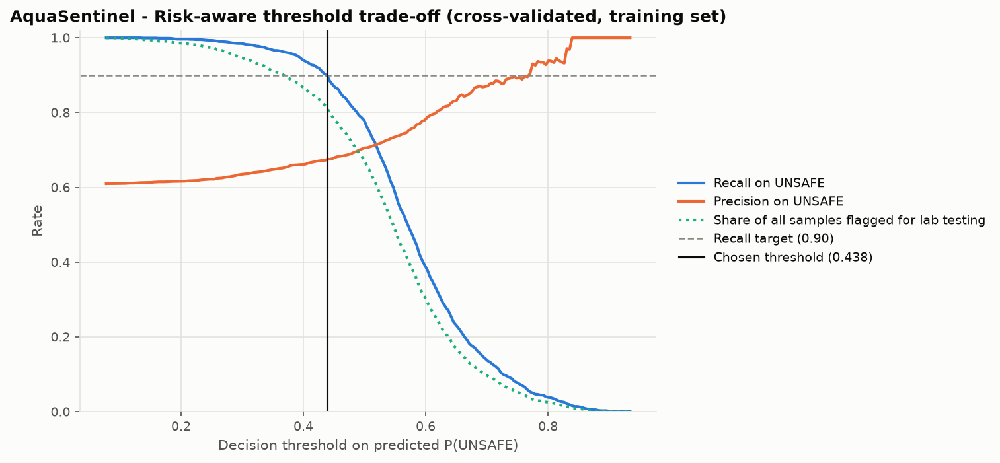

**How every model and baseline compares under cross-validation:**

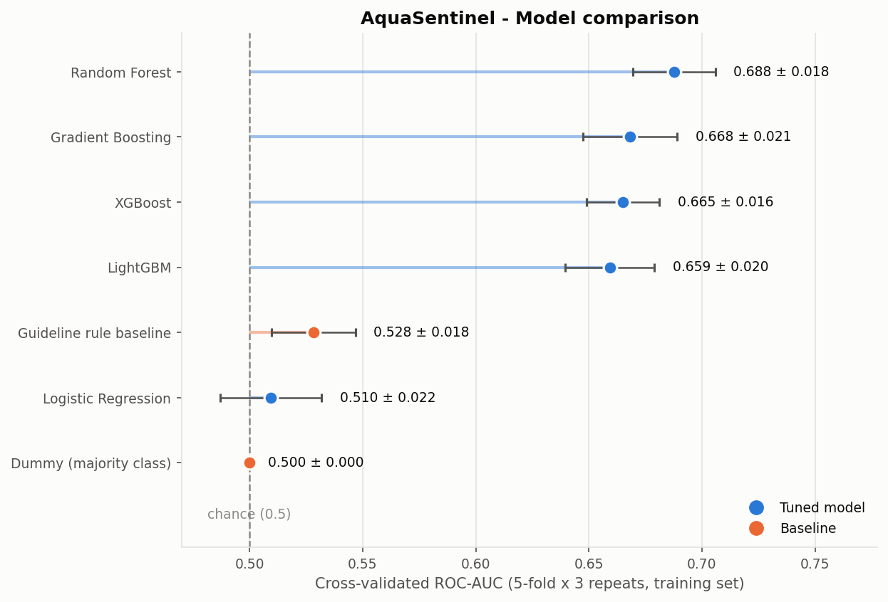

**Precision-recall on the held-out test set** (the right curve for an asymmetric-cost problem; the dashed line is the unsafe base rate, i.e. what flagging everything achieves):

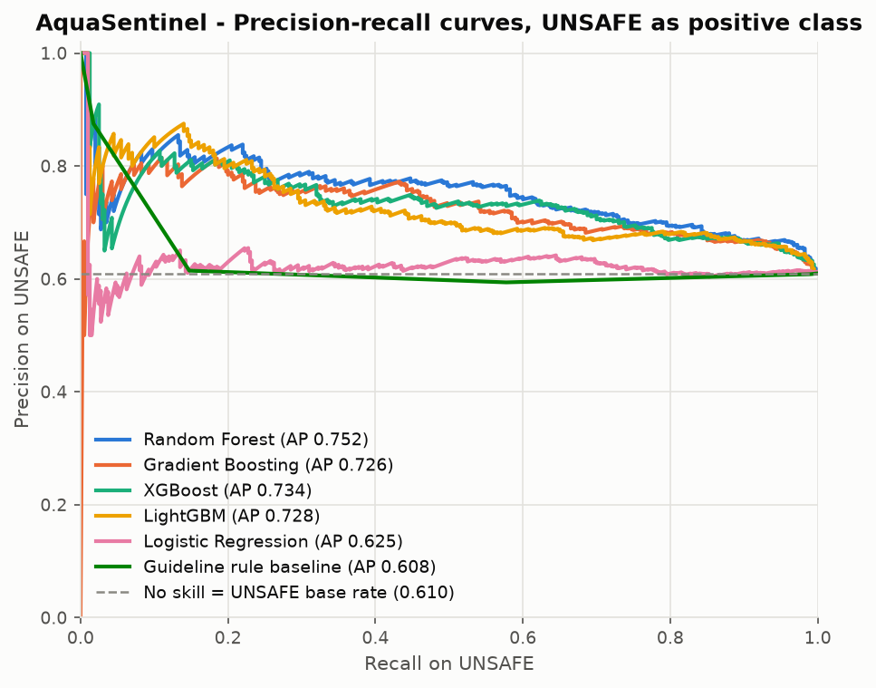

**Where the errors land at the chosen threshold:**

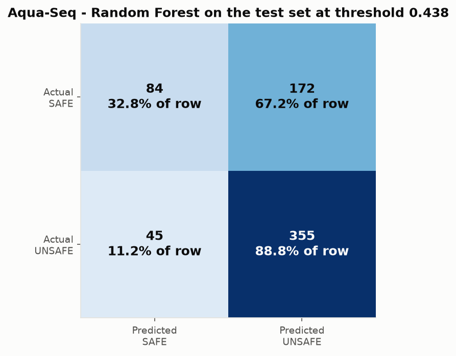

**What the model actually leans on:**

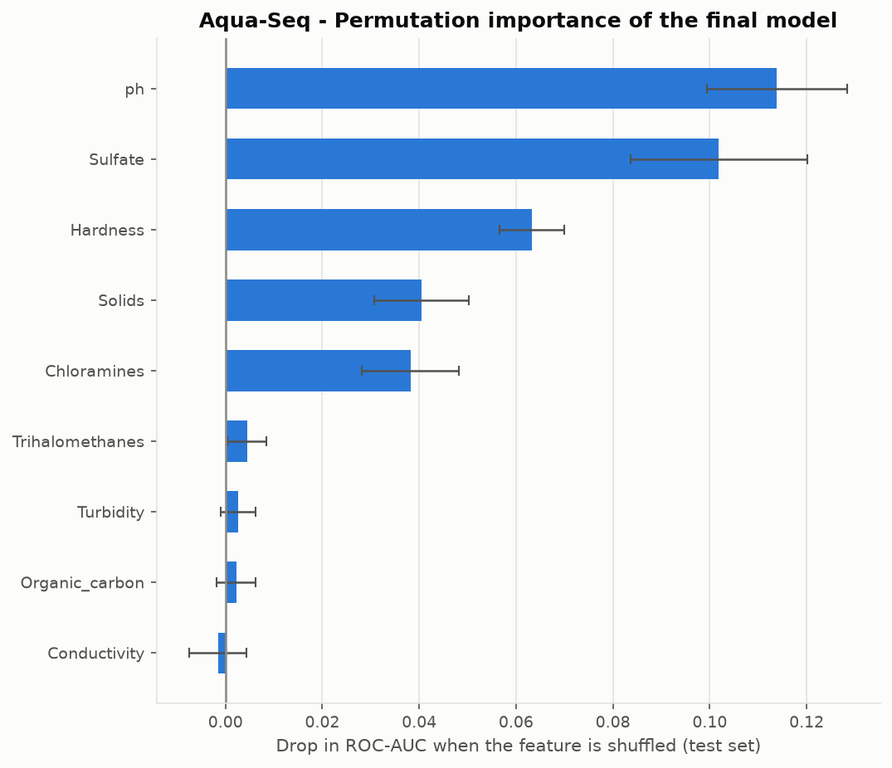

<details>
<summary>All other figures (EDA, ROC, calibration, SHAP)</summary>

| | |
|---|---|
| Class balance | 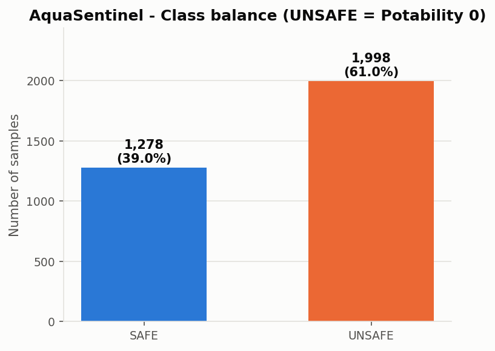 |
| Missing values | 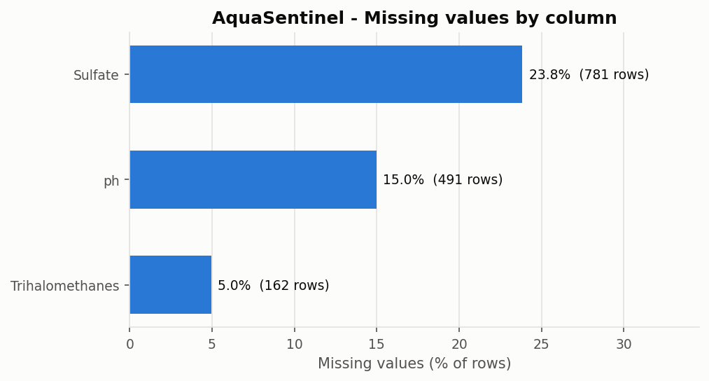 |
| Feature distributions by class | 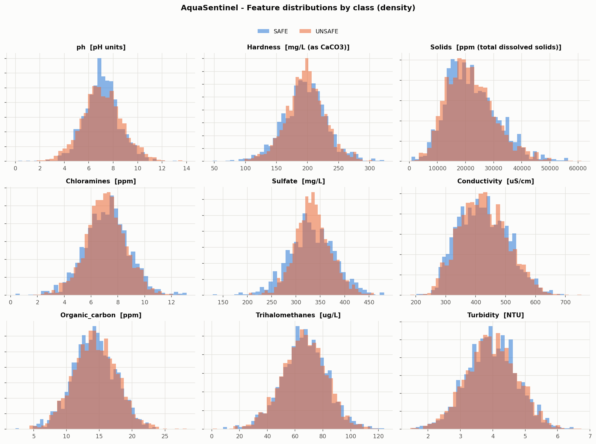 |
| Correlation matrix | 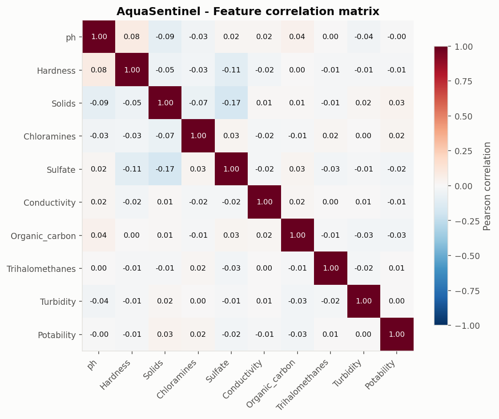 |
| ROC curves | 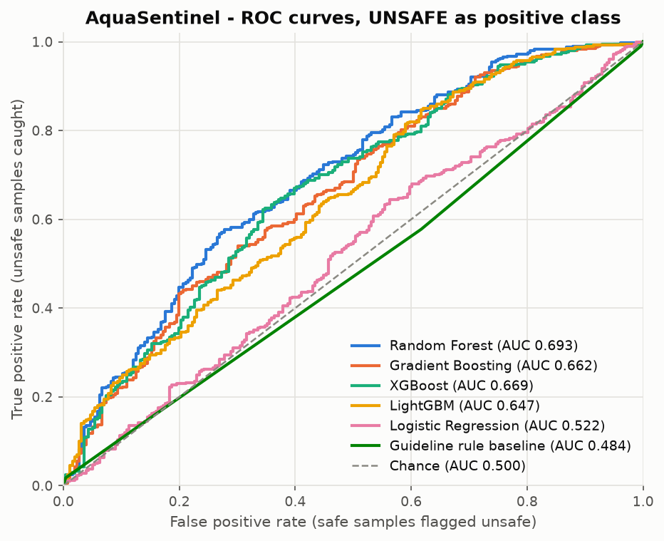 |
| Calibration | 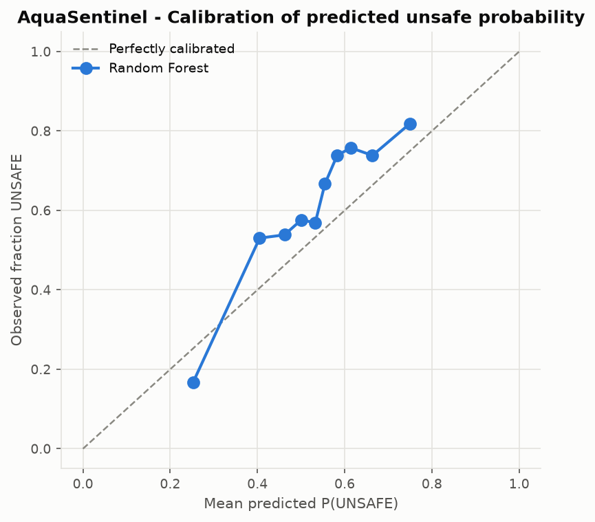 |
| SHAP summary | 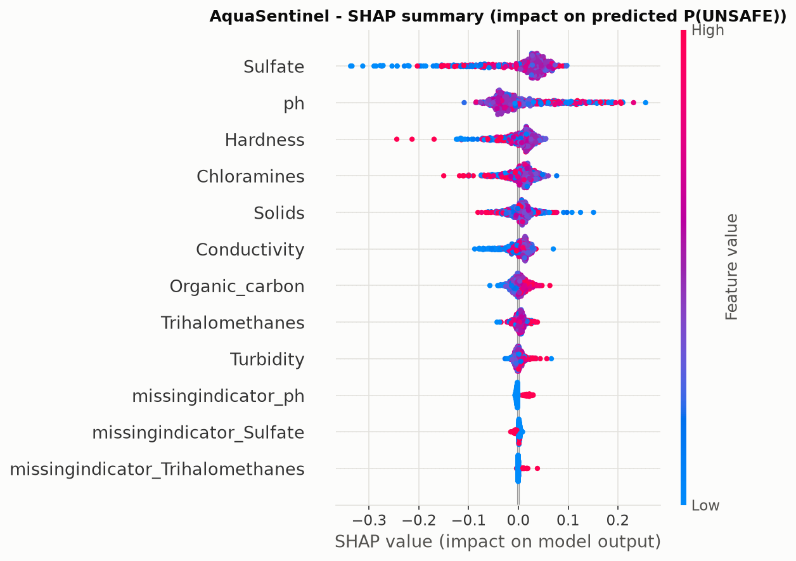 |
| SHAP dependence | 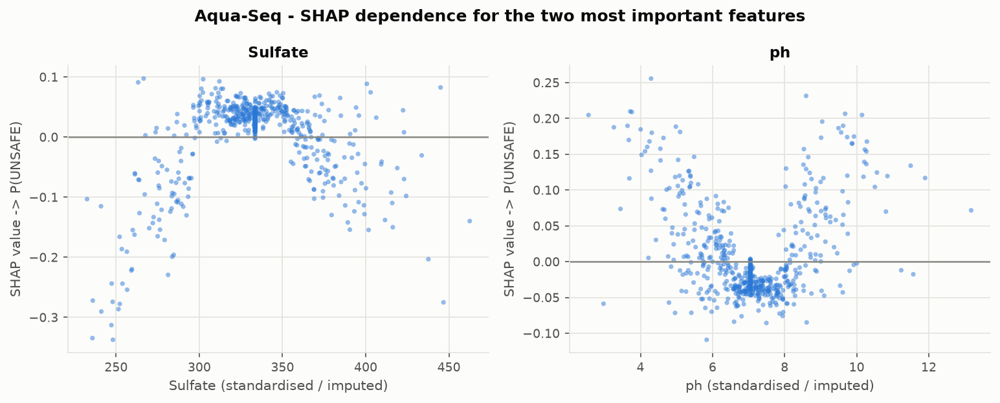 |

</details>

---

## Key findings

**1. A model can hold close to 90% recall on unsafe samples, but only by sending most of the supply to the lab.** The threshold was selected to reach 90% recall in cross-validation and delivered just under that on the held-out test set, while flagging roughly four samples in five. That is the real answer to the business question. The model does beat "test everything" on precision at matched recall, so it saves some lab capacity — but the saving is modest, and it is bought with missed unsafe samples. Whether that trade is acceptable is a policy decision, not a modelling one, and this project deliberately hands it over as a number rather than resolving it.

**2. Published drinking-water standards do not explain these labels — the rule baseline degenerates into "flag everything" and scores no better than chance.** Applying verified WHO / BIS / US EPA limits flags **100% of samples as unsafe**, because two columns sit off the drinking-water scale entirely: `Solids` breaches the BIS permissible TDS limit in 99.9% of rows (median ≈ 21,000 against a 2,000 mg/L limit) and `Chloramines` breaches the US EPA MRDL in 97.3% (median ≈ 7.1 against 4.0 mg/L). The honest conclusion is not that the guidelines are wrong but that **these measurements do not mean what their column names suggest**, which in turn undermines any claim that the labels encode real potability.

**3. Only non-linear models find any signal at all.** Logistic regression sits essentially at chance while tree ensembles clear it by a clear margin. Combined with the near-zero univariate effect sizes from the EDA, this says whatever structure exists is interaction-driven and weak — not something a better linear model or more feature engineering would rescue.

**4. The errors are not a tuning problem.** Unsafe samples the model misses and unsafe samples it catches have nearly identical predicted-score distributions and nearly identical feature profiles. There is no identifiable sub-population to repair. This is the signature of a weak feature–label relationship, and it is why no amount of additional hyperparameter search would move the headline much.

**5. Imputation choice is not the bottleneck.** Median and KNN imputation, with and without missing-indicator features, land within noise of each other under cross-validation — despite `Sulfate` missing 23.8% of its values. Worth knowing, because missingness is the most visible flaw in this dataset and it is *not* what limits performance.

### What this model can and cannot be trusted for

| Can | Cannot |
|---|---|
| Rank samples so that limited lab capacity goes to the riskier ones first | Clear a sample as safe — at the chosen threshold it still misses unsafe samples |
| Provide a transparent, tunable recall/workload dial a domain expert can set | Replace or defer laboratory testing |
| Demonstrate that these nine parameters carry only weak information about this label | Generalise to real water supplies — the data's provenance is undocumented |

---

## Limitations and honest caveats

- **This is an analysis of a public dataset, not a deployed monitoring system.** No real water supply was assessed.
- **Label quality is unknown and is probably the binding constraint.** The Kaggle page does not state how `Potability` was determined; the data is widely believed to be synthetic or semi-synthetic. A ceiling in the high-0.6s ROC-AUC with nine informative-sounding chemical parameters is more consistent with weakly-related labels than with an intrinsically hard problem. **The honest reading of this project is that the dataset, not the method, sets the ceiling.**
- **Two columns contradict their documented units,** which makes the guideline rule an exactly constant predictor (it flags every row): `Solids` has a median ≈ 21,000 against a 2,000 mg/L permissible limit, and `Chloramines` a median ≈ 7.1 against the 4.0 mg/L EPA MRDL. Reported rather than silently rescaled — rescaling them to "look right" would be inventing data.
- **Substantial missingness:** `Sulfate` 23.8%, `ph` 15.0%, `Trihalomethanes` 4.9%. It appears unrelated to the target, but those values are imputed, not measured.
- **No time, location, source or treatment information.** Each row is an isolated snapshot — nothing can be said about trends, seasonality or specific supplies.
- **3,276 rows is small** for learning subtle interactions among nine continuous features. The bootstrap intervals on the test metrics are correspondingly wide, and the gap between the top tree ensembles is within noise.
- **Two of nine parameters are absent from the rule baseline** because no numeric drinking-water limit could be verified for conductivity or total organic carbon. WHO publishes no guideline value for either, and the US EPA regulates total organic carbon by required percentage removal rather than a concentration limit.
- **WHO's trihalomethanes guidance could not be applied as written.** WHO specifies a fractional-sum rule over individual THM species; this dataset reports only the aggregate, so the US EPA's aggregate TTHM MCL was used instead and the substitution is documented in `config.py`.
- **Single train/test split.** Model selection uses repeated cross-validation, but the final estimate rests on one 656-row test set. Nested cross-validation would give a tighter estimate at considerably more compute.

---

## Reproducibility

Everything is driven by one seed (`42`) and one entry point. The script regenerates **every** metric file and figure from the raw CSV with no manual steps.

### Windows (PowerShell)

```powershell
git clone https://github.com/m0han-raj/aquasentinel.git
cd aquasentinel

python -m venv .venv
.\.venv\Scripts\Activate.ps1

python -m pip install --upgrade pip
pip install -r requirements.txt

python scripts\run_all.py
```

### Linux / macOS

```bash
git clone https://github.com/m0han-raj/aquasentinel.git
cd aquasentinel

python3 -m venv .venv
source .venv/bin/activate

python -m pip install --upgrade pip
pip install -r requirements.txt

python scripts/run_all.py
```

### Quality gate

```bash
pytest                          # 34 tests, including the no-leakage proofs
black --check src scripts tests
ruff check src scripts tests
```

### Notebooks

```bash
jupyter lab notebooks/
```

The three notebooks run the cheap steps live and read the expensive search results back from `results/metrics/`, so they display exactly the numbers `run_all.py` produced — same seed, same split, no drift.

| | |
|---|---|
| **Python** | 3.10+ (developed and verified on 3.12.10, Windows 11) |
| **Random seed** | `42`, set for Python, NumPy, scikit-learn, XGBoost and LightGBM |
| **Dependencies** | Pinned exactly in [`requirements.txt`](requirements.txt) |
| **Runtime** | See "Run metadata" in the generated results above — roughly 15–25 minutes on a laptop CPU, dominated by the hyperparameter search |

---

## Repository structure

```
aquasentinel/
├── README.md                  <- this file (results sections auto-generated)
├── LICENSE                    <- MIT
├── requirements.txt           <- pinned dependencies
├── pyproject.toml             <- package metadata, black/ruff/pytest config
│
├── data/
│   ├── README.md              <- source, license, column dictionary, how to obtain
│   ├── raw/                   <- water_potability.csv (committed; CC0)
│   └── processed/             <- train/test splits (regenerated, git-ignored)
│
├── notebooks/
│   ├── 01_data_audit_and_eda.ipynb
│   ├── 02_baselines_and_modeling.ipynb
│   └── 03_evaluation_and_explainability.ipynb
│
├── src/aquasentinel/
│   ├── config.py              <- paths, seed, label semantics, VERIFIED guideline limits
│   ├── data.py                <- load, schema validation, the single train/test split
│   ├── features.py            <- preprocessing pipelines + the guideline rule baseline
│   ├── models.py              <- model zoo + hyperparameter search spaces
│   ├── evaluate.py            <- metrics, threshold selection, bootstrap CIs, figures
│   ├── explain.py             <- permutation importance, SHAP
│   └── report.py              <- builds the README results sections from results files
│
├── scripts/
│   └── run_all.py             <- the whole pipeline, end to end, deterministic
│
├── results/
│   ├── metrics/               <- JSON + CSV (the single source of truth for the README)
│   └── figures/               <- PNG at 150 dpi
│
└── tests/
    ├── test_data.py
    ├── test_pipeline_no_leakage.py
    └── test_metrics.py
```

---

## Future work

- **Nested cross-validation** for the final estimate, removing the dependence on a single 656-row test set.
- **Cost-explicit threshold selection.** The 90% recall target is a stand-in for a real cost ratio. Given an actual cost per lab test and per missed unsafe sample, the threshold should be chosen by expected cost instead.
- **Conformal prediction** to attach per-sample validity guarantees rather than a single global operating point — more useful for triage than a point prediction.
- **Validate on a dataset with documented provenance.** The most valuable next step is not a better model but better labels: a source where sampling, measurement and the safety determination are all documented.
- **Reconsider the rule baseline against a treated-water standard** if a version of this data with trustworthy units becomes available, since the `Solids` scale makes the current comparison weaker than it should be.

---

## License

Code is released under the [MIT License](LICENSE). The underlying dataset is `CC0: Public Domain` and is redistributed here under that dedication — see [`data/README.md`](data/README.md).

## Author

**Mohan Raj K** — [github.com/m0han-raj](https://github.com/m0han-raj)
